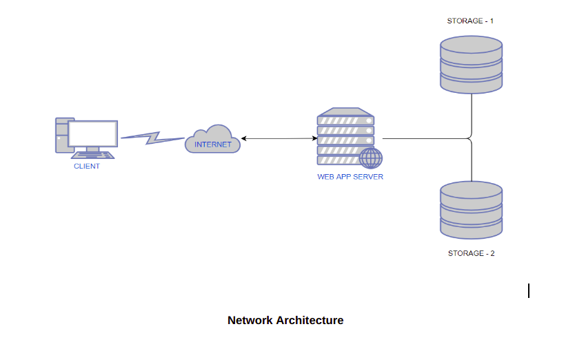
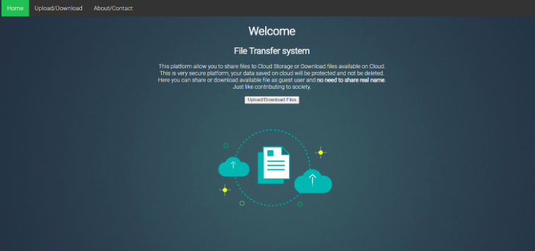
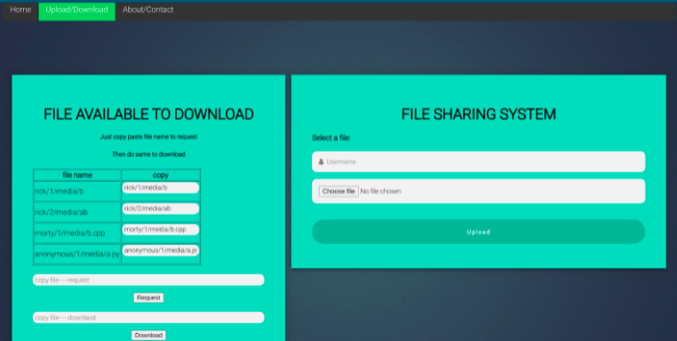

# Cloud file transfer django webapp

We created a file sharing system by Django Framework. We used HTML, CSS, Javascript for frontend and making the website dynamic. We had written client/server side for file transfer in python (Socket Programming) and integrated it into the website with Django.

## Idea
Our idea was to provide a platform that allows users located in different locations to store and share their files with other users by using the concept of cloud computing. It was based on a torrent-like file-sharing system where users can share their files privately without any privacy concerns. Our web-based applications make use of IaaS, by providing storage spaces virtually and SaaS by providing software similar to torrent that is hosted in the cloud which enables users to search, access, and download the files uploaded by various users. We have also provided features like Data redundancy which makes use of 2 cloud storage servers to store two instances of data separately so as long as one of the servers is running, the user can find and download the files to their local computer. This allows for redundancy, on-demand self service and broad network access.
## Network Architecture

## Functionality
We used Django file Upload functionality and stored files into media storage in aws ec2 instance where WebApp is hosted from where our integrated py script gets triggered and sent file to cloud storage instance. To download, we used a request path in the frontend to trigger py script to request and receive file from cloud storage and then download option from frontend user can download file on his/hers local machine. 

## Usage
Run storage.py at device/instance where you had storage for files.
make changes of IP and port number in info.py for both client.py and storage.py

Run python manage.py runserver to start webapp

To upload a file(Check screenshots), the user has to click on the ‘Choose file’ button which will allow them to locate and select the file they want to upload from their local system.While uploading a file, the user can choose to enter a username or upload anonymously without supplying a user name.
For downloading a file, the user has to request the desired file by copying the path presented in the ‘copy’ section of the downloads table and entering it in the request field.
Once the file has been requested, the user can download the file by entering the same path in the download field.
At the storage end, a python script continuously runs and accepts any incoming connections from the Web Application. Once a connection is made, we check for message packets and look for its type : Read / Write and follow the procedure based on the request made.

## Cloud Usage
We used 3 instances on AWS for hosting our website. One for hosting Django based Web-Application  and 2 instances to run server side code for file transfer to separately and securely store files shared by the user. Those 2 instances were for storage purposes.
The reason that we decided to go with 2 instances for storage was to provide a more robust and resilient service by introducing redundancy in the data storage system. The benefit of having 2 instances for storage is that if one of the storage instances goes down due to some reason, the service will still be usable because of the second storage instance.

## Final ScreenShots

